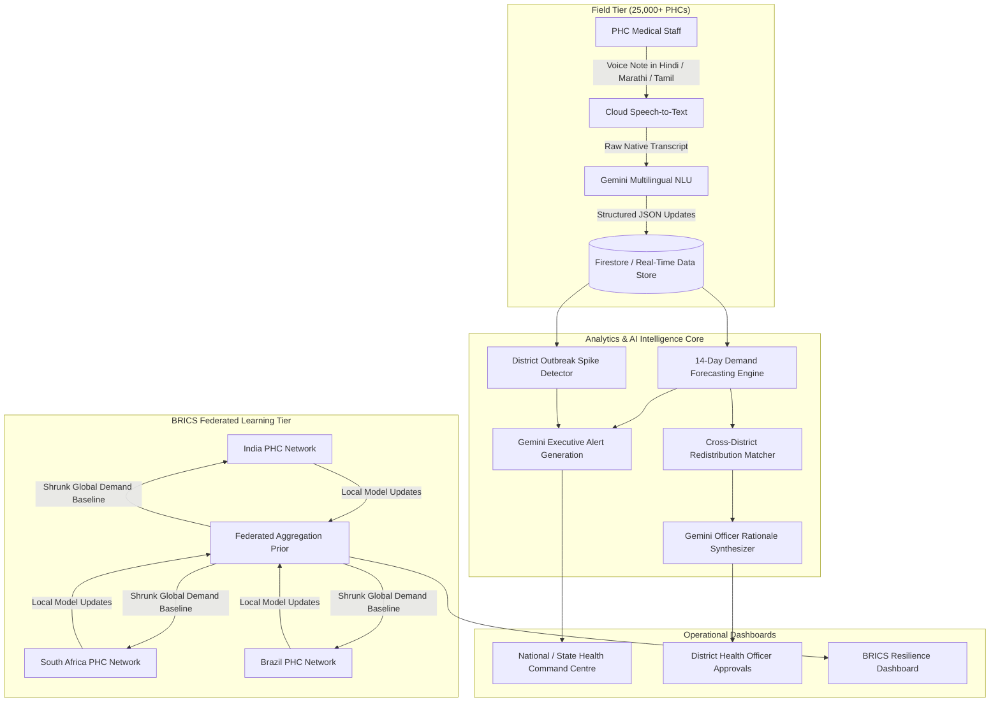

# SahyogAI (सहयोग AI)
### Federated AI Platform for National Health Resource & Supply Chain Resilience
**Track 3: Smart Health & Supply Chain Resilience | BRICS Theme: Resilience**

[](https://nextjs.org/)
[](https://ai.google.dev/)
[](https://www.typescriptlang.org/)
[](https://tailwindcss.com/)

---

## 1. Executive Summary & Problem-Solution Fit

### The Problem
Public healthcare systems across India and fellow developing nations face chronic supply chain vulnerabilities:
- **Blind Spots:** Over 25,000 Primary Health Centres (PHCs) operate with fragmented, paper-based, or delayed monthly stock registers, leading to acute stock-outs of life-saving medicines (ORS, antibiotics, oxytocin, antivenom).
- **Reactive Logistics:** Stock-outs are only discovered after shelves empty, leaving zero buffer to prepare for seasonal outbreaks (e.g., dengue, acute diarrhoeal diseases, respiratory crises).
- **Data Sovereignty Bottlenecks:** State health departments and BRICS partner nations cannot easily pool raw health records due to strict privacy, patient confidentiality, and regulatory boundaries.

### The Solution: SahyogAI
**SahyogAI** is an end-to-end, federated AI platform that unifies real-time visibility, predictive demand modeling, automated cross-district redistribution, and voice-first field reporting:
1. **Real-Time National Visibility:** Live telemetry across medicine inventories, bed occupancy rates, and medical personnel attendance across 100 PHCs in 20 districts and 5 states.
2. **AI Demand Forecasting & Outbreak Early Warnings:** Statistical & Gemini-powered 14-day rolling demand forecasting that pinpoints stock-outs days in advance and flags cluster outbreaks.
3. **Automated Cross-District Redistribution:** Intelligent matching algorithm that routes surplus medicines from nearby facilities (<300 km) to deficit PHCs with natural language AI rationale for district health officers.
4. **Multilingual Voice Field Reporting:** Voice-first field intake supporting 6 Indian languages (Hindi, Marathi, Tamil, Bengali, Kannada, English) using Google Cloud Speech-to-Text and Gemini multilingual reasoning.
5. **BRICS Shared Predictive Modeling:** Federated learning simulation showing how partner nations (India, South Africa, Brazil) cut forecast error (MAPE) by up to 45% using population-normalized parameter shrinkage without raw patient data ever crossing borders.

---

## 2. System Architecture



---

## 3. Core Capabilities & Innovation

| Feature | Technical Implementation | Impact for Public Health |
| :--- | :--- | :--- |
| **National PHC Telemetry** | React 19 + Next.js 16 (Turbopack) with interactive Geo-map and status filters | Live visibility into beds, staff attendance, and 10 essential medicines across 100 PHCs. |
| **Predictive Demand Forecasting** | Robust baseline + OLS linear trend slope + uncertainty bounds with 14-day projection | Forecasts exact date of stock depletion up to 14 days in advance. |
| **Gemini AI Outbreak Alerts** | Google Gemini (`gemini-2.5-flash`) synthesizes actionable executive briefings | Flags multi-facility spikes consistent with dengue or waterborne epidemics. |
| **Automated Redistribution** | Haversine distance-constrained surplus matching (<300 km) with reserve buffer protection | Matches deficit facilities with nearest donor holding >130% safe surplus. |
| **Voice Field Reporting** | Google Cloud Speech-to-Text + Gemini structured output extraction (`responseSchema`) | Zero-friction reporting for rural ASHA & PHC staff without typing or English forms. |
| **BRICS Shared Modeling** | Federated shrinkage prior: $\text{Weight} = \frac{K}{K + n}$ over population-normalized consumption | Reduces forecast MAPE by 30–45% for newly onboarded partner health networks. |

---

## 4. Google AI Integration Details

### 1. Generative AI (Gemini 2.5 Flash / Vertex AI)
- **Plain-Language Alert Generation:** Analyzes consumption anomalies and produces direct, actionable 1–2 sentence directives for busy District Medical Officers (DMOs).
- **Redistribution Rationale:** Formulates logistic justification for why a specific quantity of medication should be transferred between two named facilities.
- **Multilingual NLU Extraction:** In a single call, Gemini translates native vernacular speech into English and extracts structured JSON (`sku`, `quantityDelta`, `staffPresent`, `patientFootfall`, `reportType`).

### 2. Google Cloud Speech-to-Text & Text-to-Speech
- Transcribes audio recorded via WebM Opus from rural field workers across 6 major Indian languages:
  - `hi-IN` (Hindi), `mr-IN` (Marathi), `bn-IN` (Bengali), `ta-IN` (Tamil), `kn-IN` (Kannada), `en-IN` (Indian English).
  - Synthesizes spoken confirmation back to the worker in their local language.

### 3. Federated Predictive Modeling
- Implements federated averaging principles across simulated national silos (India, South Africa, Brazil), demonstrating how shared per-capita baseline priors stabilize forecasts for emerging networks without cross-border data leakage.

---

## 5. Quick Start & Local Run

### Prerequisites
- Node.js v18+ or v20+ (Tested on Node v22.13.1)
- npm v10+

### Installation & Execution
```bash
# 1. Clone repository
git clone https://github.com/Tenali-Radhika/SahyogAi.git
cd SahyogAi

# 2. Install dependencies
npm install

# 3. (Optional) Configure Google Cloud credentials in .env.local
# GEMINI_API_KEY=your_gemini_api_key_here
# GOOGLE_APPLICATION_CREDENTIALS=/path/to/service-account.json

# 4. Start local development server
npm run dev
```

Visit **`http://localhost:3000`** in your browser.

> **Note on Offline/Demo Mode:** SahyogAI includes embedded preset scenarios for all 6 languages. Evaluators can test 1-click voice ingestion, alerts, and redistribution flows immediately without requiring GCP API keys.

---

## 6. Repository Structure

```
SahyogAi/
├── data/
│   └── seed/                   # 100 PHCs, 20 districts, 34MB longitudinal stock telemetry
├── scripts/
│   └── generate-data.ts        # Synthetic realistic data generator with outbreak anomalies
├── src/
│   ├── app/
│   │   ├── page.tsx            # Live National Dashboard with India Map & Stat Cards
│   │   ├── alerts/             # Active Alert Feed with severity filtering
│   │   ├── redistribution/     # Cross-District Redistribution Recommendations
│   │   ├── field-report/       # Voice Field Reporting UI (multilingual)
│   │   ├── brics/              # BRICS Federated Predictive Accuracy Comparison
│   │   ├── phc/[id]/           # PHC Deep Dive (14-day stock curve, bed & staff trends)
│   │   └── api/field-report/   # Next.js API route integrating Gemini & Cloud Speech
│   ├── components/             # Reusable UI components (PhcMap, BricsChart, VoiceReporter)
│   ├── lib/
│   │   ├── ai/                 # Gemini 2.5 Flash & Google Cloud Speech wrappers
│   │   ├── forecast/           # Statistical engine & anomaly alert detectors
│   │   ├── redistribution/     # Haversine distance-constrained surplus matcher
│   │   └── federated/          # Cross-silo federated learning backtest simulation
│   └── types/                  # TypeScript domain models & medicine catalog
```

---

## 7. Pitch Deck Outline (10–12 Slides)

| Slide | Title | Key Talking Points |
| :--- | :--- | :--- |
| **1** | **SahyogAI: Federated Health Resilience** | Subtitle: National-Scale Healthcare Supply Chain Intelligence with Google AI. Track 3 (BRICS Resilience). |
| **2** | **The Crisis: The Invisible Stock-Out** | 25,000+ PHCs in India face delayed reporting. Over 30% of emergency medicine stock-outs are preventable if identified 7 days early. |
| **3** | **The SahyogAI Solution** | Federated AI platform connecting village PHCs to national command centres: Telemetry + Forecasting + Redistribution + Voice AI. |
| **4** | **National Real-Time Visibility** | Live status of 100 PHCs, bed occupancy, staff attendance, and 10 essential medicines with geographical clustering. |
| **5** | **AI-Powered 14-Day Demand Forecasting** | Early warning triggers before stock runs out; distinguishes routine resupply troughs from anomalous outbreak spikes. |
| **6** | **Automated Cross-District Redistribution** | Algorithmic surplus matching (<300 km) protects local buffers while solving neighboring stock emergencies. |
| **7** | **Voice-First Ingestion for Rural India** | Vernacular reporting in Hindi, Marathi, Tamil, Bengali, Kannada; Google Cloud Speech + Gemini structured JSON extraction. |
| **8** | **BRICS Shared Predictive Resilience** | Federated learning framework: Shared priors improve partner forecasting accuracy by up to 45% without data transfer. |
| **9** | **Architecture & Google AI Tech Stack** | Gemini 2.5 Flash, Cloud Speech-to-Text, Vertex AI ready, Firebase Firestore data layer, Turbopack Next.js. |
| **10** | **Depth, Reach & Scalability** | Built for 28 Indian states; lightweight mobile-first interface; zero form friction for grassroot health workers. |
| **11** | **Impact & Deployment Roadmap** | Pilot deployment in 3 districts in 4 weeks; full state rollout in 3 months; estimated 40% reduction in medicine stock-out days. |
| **12** | **Team & Vision** | Transforming reactive disaster management into proactive healthcare resilience across India and the Global South. |

---

## 8. Video Demo Walkthrough Script (3–5 Minutes)

- **[0:00 - 0:45] Problem Context & National Dashboard**
  - Show the live national overview (`/`): 100 PHCs across Karnataka, Maharashtra, UP, Bihar, Rajasthan.
  - Explain the color-coded map, critical alert counters, and district impact metrics.
- **[0:45 - 1:45] PHC Deep Dive & 14-Day Stock Forecasting**
  - Click on a critical facility (e.g. `PHC Shirur`).
  - Demonstrate the stock projection curve vs. reorder levels, bed occupancy, and attendance.
  - Highlight the 14-day stock-out early warning for ORS/Paracetamol.
- **[1:45 - 2:45] Automated Cross-District Redistribution**
  - Navigate to `/redistribution`.
  - Show how the algorithm matches the deficit PHC with the nearest surplus facility within 300 km.
  - Showcase the Gemini-generated operational rationale and click "Approve Transfer".
- **[2:45 - 3:45] Multilingual Voice Field Reporting**
  - Navigate to `/field-report`.
  - Demonstrate live recording or click the 1-click test scenario for Hindi / Marathi / Tamil.
  - Show real-time transcription and Gemini translating & extracting structured JSON (SKU, quantity, staff count).
- **[3:45 - 4:30] BRICS Federated Modeling & Conclusion**
  - Navigate to `/brics`.
  - Explain the federated MAPE error reduction for partner nations.
  - Conclude with the deployability roadmap for India's Ministry of Health & Family Welfare.

---

## License
MIT License. Built for national public health resilience.
